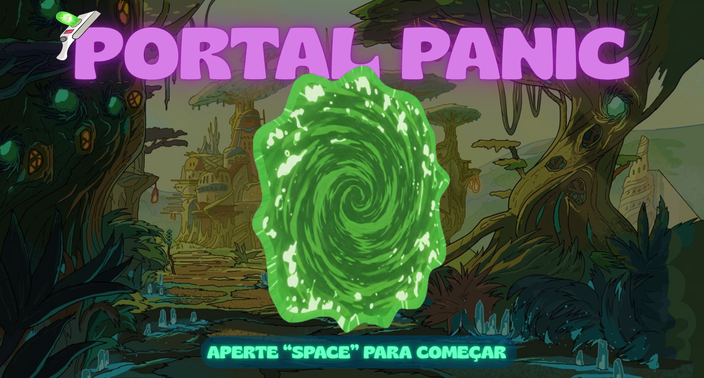
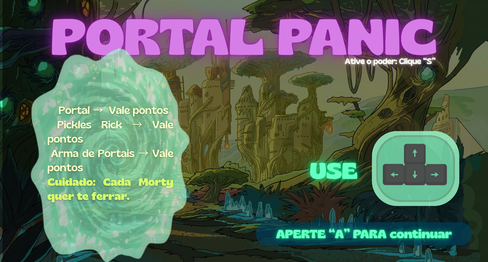

# 🌀 Portal Panic


Portal Panic é um jogo arcade em Python feito com Pygame, ambientado no universo caótico de Rick and Morty. Você controla Rick Sanchez em uma corrida interdimensional por pontos, portais e... picles!

Prepare-se para fugir dos Mortys, usar sua arma de portais e ativar poderes malucos enquanto tenta alcançar a maior pontuação possível.

---

## 🎮 Imagens do Jogo

**Tela Inicial**  


**Tutorial**  


**Tela de Derrota**  


---

## 🧪 Objetivo

O objetivo é acumular o máximo de pontos possível enquanto Rick coleta portais, picles e sua arma de portais. Mas cuidado: os Mortys não vão facilitar a sua vida. Se eles encostarem em você, é game over.

---

## 🕹️ Controles

- Setas do teclado → Movimentação  
- Tecla "S" → Ativa um poder especial  
- Tecla "SPACE" → Começa o jogo  
- Tecla "A" → Continua após o tutorial  
- Tecla "D" → Reinicia o jogo após perder  

---

## 🔧 Tecnologias Utilizadas

- Python  
- Pygame  

---

## 👩‍💻 Autora

Desenvolvido por Gabriela Peratello Silva como parte de um projeto escolar.  
Feito com humor, dedicação e referências interdimensionais.

---

## 📂 Como Rodar

Clone o repositório:

```bash
git clone https://github.com/seu-usuario/seu-repo.git
Instale o Pygame:

bash
Copiar
Editar
pip install pygame
Execute o jogo:

bash
Copiar
Editar
python main.py
💬 Observações
As imagens foram criadas pela autora com ícones e artes retiradas da internet.

Este projeto é de uso educacional e sem fins lucrativos.

Rick aprovaria esse jogo? Provavelmente não... mas ele jogaria mesmo assim.


